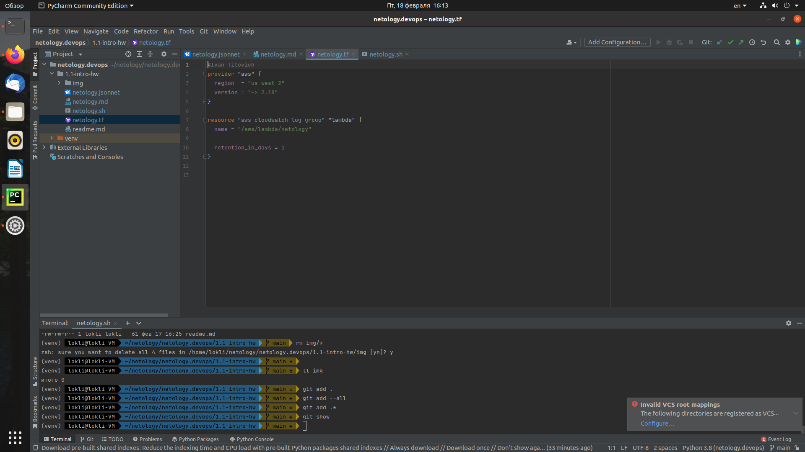
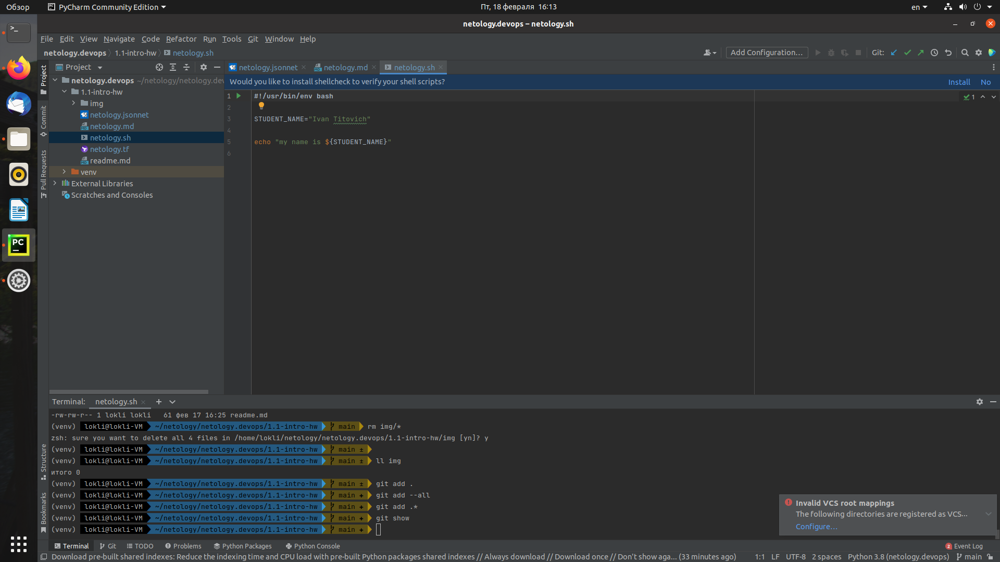
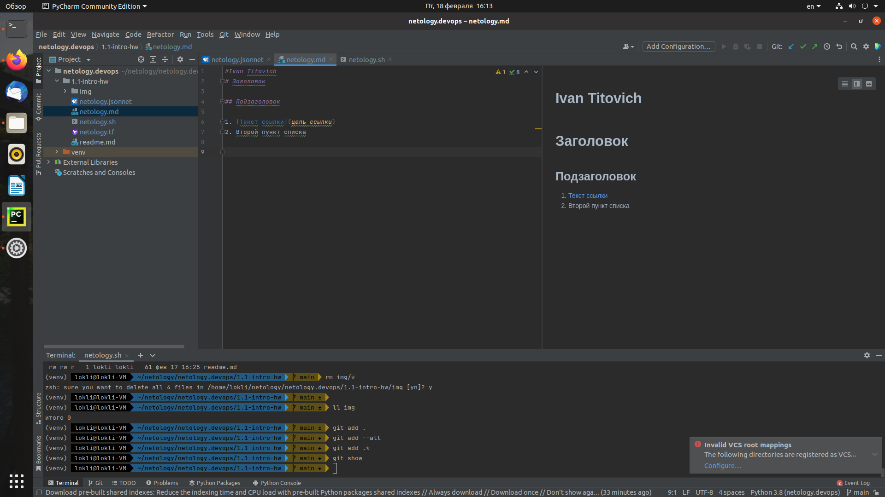
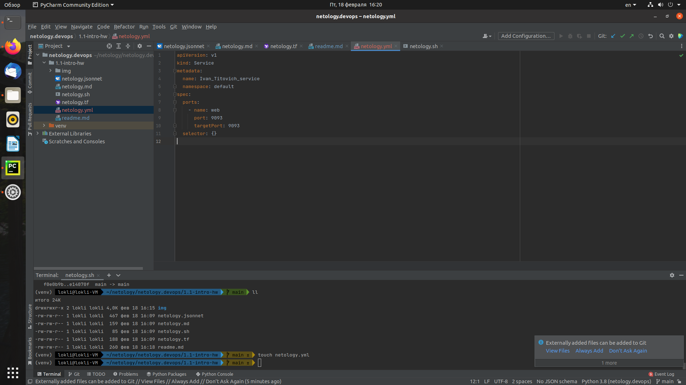
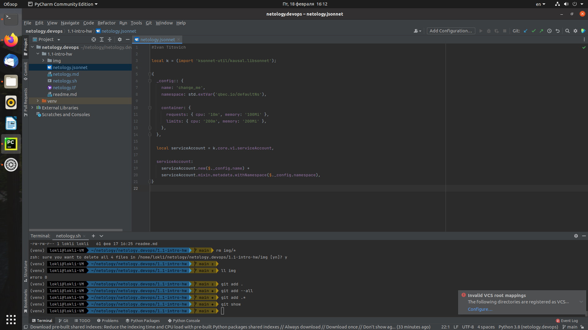

# Введение в DevOps

## Домашняя работа студента: Иван Титович
### Задание 1:
   - Terraform: 
   - Bash: 
   - Markdown: 
   - Yaml: 
   - Jsonnet: 
### Задание 2

1. Постановка задачи заказчиком менеджеру проекта.
2. Менеджер проекта ставит задачу тилиду разработчиков, которую необходимо реализовать. 
3. Разработчик разбивает задачу на подзадачи и поручает разработчикам. 
4. Разработчики написав код проводят юнит-тестирование. 
5. Если юнит-тесты прошли успешно разработчик отправляет код на ревью тимлиду. 
6. Тимлид после анализа кода мерджит код в тестовую ветку системы контроля версий. 
7. Если необходимо собирать приложение - его собирают (в идеале - автоматизированно, за организацию автоматизии сборки приложения и доставки в тестовую среду отвечает DevOps инженер).
8. После размещения приложения в тестовой среде команда тестеров приступает к тестированию нового функционала. 
9. Если во время тестирования обнаружен критический баг - тестеровщики отправляют баг-репорт и процесс разработки возвращается в п.3. Если багов не обнаружено - п.10
10. Тимлиду поступает информация о успешном тестировании нового функционала и он принимает решение о деплое приложения в продакшн.

DevOps инженер в процессе разработки настраивает автотизацию сборки приложения после коммита в develop ветке приложения, разворачивает приложение в тестовом контуре. Настраивает среду для публикации приложения в продакшн. Мониторит в процессе эксплуатации ошибки и устраняет их. 

